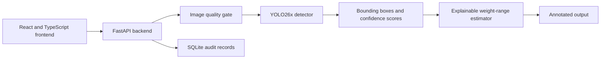

# Waste Material Detector And Scrap Valuation

Python and React application for detecting scrap and waste materials with an
Ultralytics YOLO model, estimating approximate material weight ranges, and
recording input/output audit evidence for later review.

The project converts manual scrap and waste inspection into a faster, more traceable,
AI-assisted workflow. It is a complete inspection pipeline, not only a model:
the system validates images, runs inference, annotates detections, estimates
weight ranges, and stores every inspection in SQLite.

## System Architecture



The public repository contains the source code, configuration, and
documentation. Large datasets, generated audit records, training logs, and
trained checkpoints may be excluded from public sharing depending on size and
data ownership constraints.

## Project Structure

```text
Tata_Internship/
  frontend/
    src/
      App.css
      App.tsx
      api.ts
      index.css
      main.tsx
      types.ts
    dist/
    index.html
    package.json
    package-lock.json
    tsconfig*.json
    vite.config.ts
    eslint.config.js
  backend/
    configs/
      full_dataset_box.yaml
      materials.yaml
    datasets/
      full_dataset_box/
        images/
          train/
          val/
          test/
        labels/
          train/
          val/
          test/
    models/
      final.pt
      final_general_backup.pt
    scripts/
      audit_logs.py
      evaluate_yolo.py
      run_web.py
      train_yolo.py
    src/
      waste_detector/
        __init__.py
        config.py
        estimator.py
        types.py
      waste_web/
        __init__.py
        database.py
        inference.py
        main.py
        quality.py
        schemas.py
        settings.py
    logs/
    runs/
    yolo26x.pt
  data/
    uploads/
    outputs/
    audit/
  .env.example
  .gitignore
  LICENSE
  README.md
  requirements.txt
  start_app.ps1
```

## Installation

```powershell
python -m venv .venv
.\.venv\Scripts\Activate.ps1
pip install -r requirements.txt
```

Build the frontend before starting the application:

```powershell
cd frontend
npm install
npm run build
cd ..
```

## Run The Application

Place a compatible trained checkpoint at `backend/models/final.pt`, then run:

```powershell
.\start_app.ps1
```

Open:

```text
http://127.0.0.1:8000
```

The application supports:

- multiple image uploads
- image resolution, blur, contrast, and exposure validation
- confidence threshold control
- YOLO material detection
- annotated output images
- bounding-box area with material fill-ratio correction
- object, image, and pile expected weight ranges
- SQLite input/output audit records
- searchable run history with input/output previews
- rerunning a previous inspection with a new confidence threshold
- collapsible desktop navigation with persistent expanded/collapsed preference
- light/dark UI theme switching
- SQLite-backed operations dashboard with lifetime, daily, trend, material-mix,
  success-rate, image-volume, and runtime metrics

The sidebar separates the operator workflow into:

- **Inspection** for new image uploads and detection
- **Run history** for previous records, findings, and reruns
- **System** for inspection activity, detected-object trends, material mix, and
  runtime readiness

## Runtime Files

The website uses:

```text
backend/models/final.pt
backend/configs/full_dataset_box.yaml
backend/configs/materials.yaml
frontend/dist/
backend/scripts/run_web.py
backend/src/waste_detector/
backend/src/waste_web/
```

Runtime data is generated automatically under:

```text
data/uploads/
data/outputs/
data/audit/audit.db
```

## Dataset

The main trainable YOLO detection dataset is:

```text
backend/datasets/full_dataset_box
backend/configs/full_dataset_box.yaml
```

Current YOLO split sizes:

```text
train: 36,027 images, 259,391 objects
val:    5,036 images,  42,466 objects
test:   4,739 images,  28,615 objects
total: 45,802 images, 330,472 objects
```

The final training dataset includes selected and remapped detection data from:

```text
CylinDeRS
YOLO Waste Detection
dataset.zip recycling-belt dataset
TACO
ZeroWaste-f
SteelDS a1 and a2
Open Images V7 material subsets
custom Tata-site evaluation images
```

Only annotations that mapped safely to the project classes were included.
Generic garbage labels, classification-only datasets, unusable augmented
duplicates, and datasets without suitable object boxes were excluded.

SteelDS class 1 (steel) was mapped into the project's `cast_iron`
ferrous-metal bucket. Its YOLO segmentation polygons were converted to
detection boxes. One frame in every 10 consecutive video frames was retained
to reduce temporal redundancy and prevent the ferrous class from dominating
the dataset. Copper annotations were excluded because the project has no
copper class.

The active `full_dataset_box.yaml` points to `backend/datasets/full_dataset_box`.
The dataset itself can be kept outside public repository sharing because of
its size and the independent terms of its source datasets.

The dataset passed Ultralytics scanning with zero corrupt images and is used
for YOLO bounding-box detection training.

Configured classes:

```text
cast_iron
cloth
gas_cylinder
dust
pitted_sheets
left_over_paint
plastics
rubber
tin
water
wood
```

## Train YOLO

The final detector is a YOLO26x bounding-box model. For the latest final
fine-tuning workflow, continue from the current checkpoint:

```powershell
cd C:\Users\Riitom\Desktop\Program\Tata_Internship

$runName = "train_oversampled_eval_b4_$(Get-Date -Format 'yyyyMMdd_HHmmss')"
$log = "backend\logs\$runName.log"

New-Item -ItemType Directory -Force -Path backend\logs | Out-Null

python backend\scripts\train_yolo.py --data configs\full_dataset_box.yaml --model models\final.pt --epochs 10 --imgsz 640 --batch 4 --workers 4 --lr0 0.00005 --warmup-epochs 0 --optimizer AdamW --amp --mosaic 0 --erasing 0 --close-mosaic 0 --project . --name $runName --final-model models\final.pt 2>&1 | Tee-Object -FilePath $log
```

The training script resolves relative `--data`, `--model`, `--project`, and
`--final-model` paths from inside `backend/`. The command above writes the run
folder under `backend/`, the log under `backend/logs/`, and the final checkpoint
to:

```text
backend/models/final.pt
```

Reduce the batch size if CUDA runs out of memory.

## Evaluate YOLO

Evaluate the active checkpoint with:

```powershell
python backend\scripts\evaluate_yolo.py --model models\final.pt --data configs\full_dataset_box.yaml --split val --imgsz 640 --batch 4
```

Latest final fine-tuning validation metrics:

```text
Run:        train_oversampled_eval_b4_20260627_145422
Model:      YOLO26x bounding-box detector
Epochs:     10
Image size: 640
Batch:      4
Workers:    4

Precision:  0.7761
Recall:     0.6581
mAP50:      0.7247
mAP50-95:   0.5724
```

Model-selection summary used for the project presentation:

```text
YOLO26x bounding-box: mAP50-95 approximately 58
Faster R-CNN:         mAP50-95 approximately 46
YOLO26x segmentation: mAP50-95 approximately 38
```

YOLO26x bounding-box detection was selected because it gave the best practical
balance of detection accuracy, inference speed, training time, and integration
simplicity for the web application.

## Weight Estimation

Weight is not directly predicted by the ML model. The model predicts bounding
boxes, material class labels, and confidence scores. The backend then estimates
weight using an explainable engineering formula:

```text
bounding-box area
-> material fill ratio
-> calibrated image area
-> assumed thickness
-> material density
-> estimated weight
```

Material properties are configured in:

```text
backend/configs/materials.yaml
```

Each material also has a `weight_uncertainty_ratio`. The midpoint is calculated
from area, thickness, density, and fill ratio; the website displays the
resulting minimum-to-maximum expected range rather than the midpoint alone.

The backend uses the detected bounding-box area multiplied by a
material-specific fill ratio. This keeps the estimate explainable and is why
the UI reports an expected range rather than a single exact weight.

The result is an approximate engineering estimate, not a replacement for an
industrial weighing system. Camera calibration and measured reference samples
are required for operational accuracy.

## Image Quality Gate

Every uploaded image is checked before the model runs. Detection is stopped
when an image is too small, blurred, low contrast, too dark, or overexposed.
The interface shows the rejected filename, quality score, and corrective
reason. Thresholds can be adjusted through:

```text
WASTE_QUALITY_MIN_DIMENSION
WASTE_QUALITY_MIN_BLUR
WASTE_QUALITY_MIN_CONTRAST
WASTE_QUALITY_MIN_BRIGHTNESS
WASTE_QUALITY_MAX_BRIGHTNESS
```

## Audit History

SQLite stores the original image, annotated output, detections, confidence,
weight ranges, quality result, settings, and rerun lineage. Operators can
inspect this history from the website. The run-history screen displays raw
inputs alongside AI-annotated outputs so previous inspections remain
traceable.

## Auditor Records

```powershell
python backend\scripts\audit_logs.py database
python backend\scripts\audit_logs.py list --limit 25
python backend\scripts\audit_logs.py show <run_id>
python backend\scripts\audit_logs.py export <run_id>
```

The auditor API remains disabled unless `WASTE_AUDIT_KEY` is configured.

## Operations Dashboard

The System page provides a high-level overview of detector and inspection
activity:

```text
total inspections
inspections today
objects detected
objects today
images processed
success rate
average run time
failed runs
seven-day inspection movement
lifetime detected-material mix
detector readiness
audit database status
```

This supports the project goal of turning undocumented manual inspection into
a measurable, reviewable, data-driven workflow.

## Submission Summary

The final detector is Ultralytics YOLO26x because it provided better practical
performance and faster inference than the earlier Faster R-CNN and
segmentation approaches. The surrounding image validation, weight-estimation,
audit, and web application layers remain separate from the detector so the
model can be retrained or replaced without rewriting the full system.
